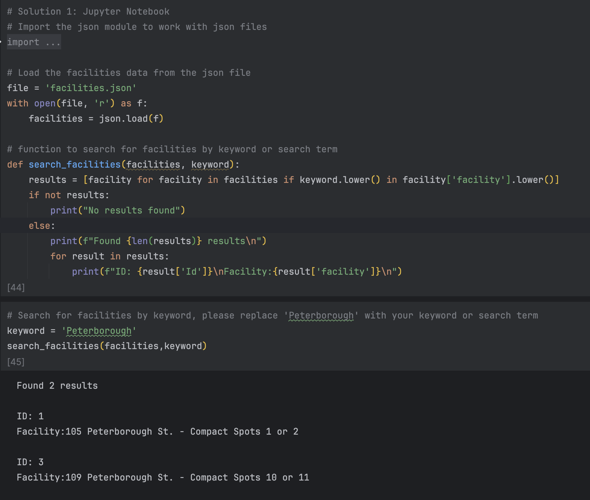
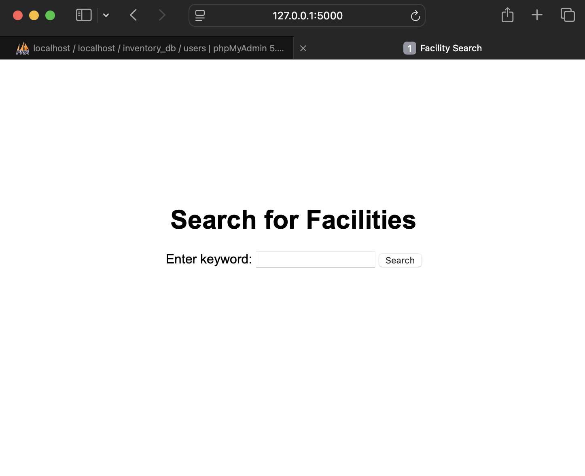
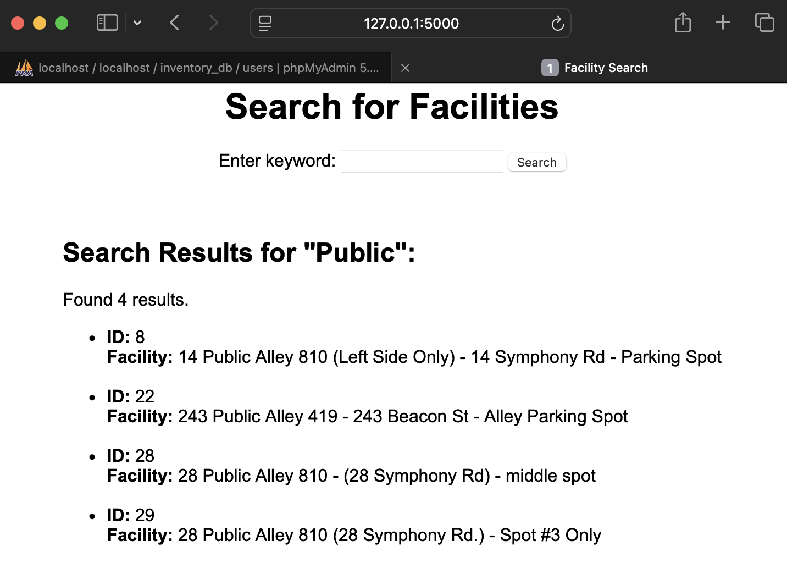
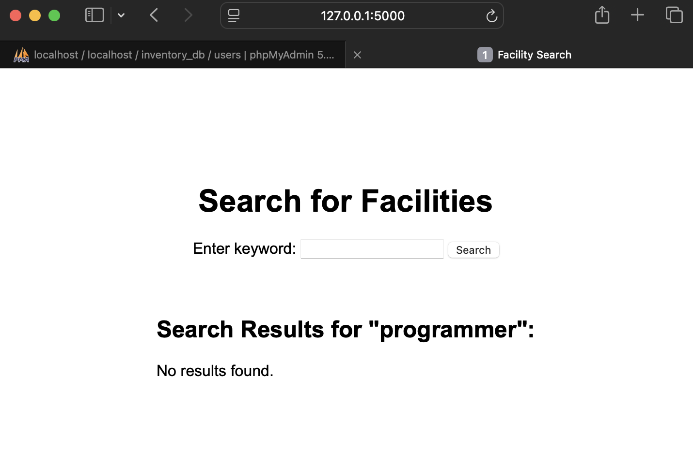
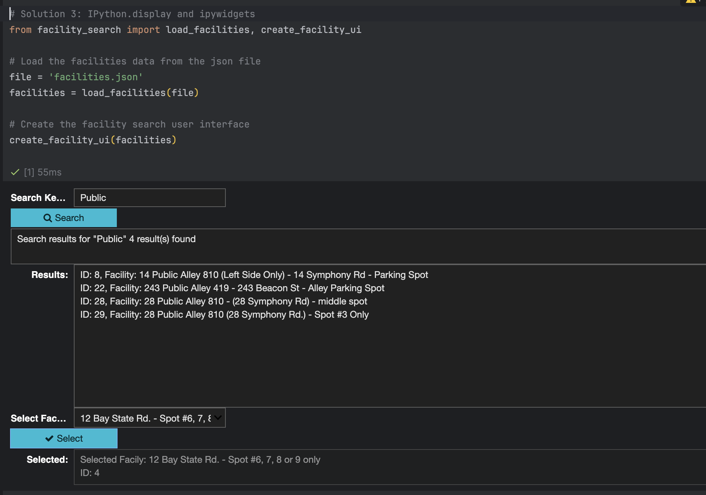

# Search and extract data from JSON data sources ( A example of facility search solutions)
A collection of three different approaches to search, extract and visualize data ex.facility data from JSON data sources ex.a JSON file. Solutions include simple Jupyter Notebook, Flask, and ipywidgets with IPython.display.

This repository contains three different solutions for searching, extracting and visualizing data ex.facility data from JSON data sources ex.`facilities.json` file. Each approach offers a unique method for interacting with the data, ranging from simple terminal-based solutions to more advanced interactive user interfaces using Flask and IPython.display.

## Table of Contents

- [Solutions](#solutions)
  - [Solution 1: Jupyter Notebook](#solution-1-jupyter-notebook)
  - [Solution 2: Flask Web Application](#solution-2-flask-web-application)
  - [Solution 3: IPython.display and ipywidgets](#solution-3-ipython-display-and-ipywidgets)
- [Installation and Usage](#installation-and-usage)
- [Facility Data](#facility-data)
- [Contributing](#contributing)
- [License](#license)

---

## Solutions

### Solution 1: Jupyter Notebook

This is the simplest implementation where we directly search the facility list using Python in a Jupyter Notebook. The solution allows the user to enter a keyword and search the facility names, printing the results (ID and facility name) directly to the console.

#### Image:



#### Code:
```python
import json

# Load the facilities data from the json file
file = 'facilities.json'
with open(file, 'r') as f:
    facilities = json.load(f)

# function to search for facilities by keyword or search term
def search_facilities(facilities, keyword):
    results = [facility for facility in facilities if keyword.lower() in facility['facility'].lower()]
    if not results:
        print("No results found")
    else:
        print(f"Found {len(results)} results\n")
        for result in results:
            print(f"ID: {result['Id']}\nFacility: {result['facility']}\n")

# Example search for facilities
keyword = 'Peterborough'
search_facilities(facilities, keyword)
```


### Solution 2: Flask Web Application

The second solution is a more advanced web-based application built using Flask. It includes a web interface where users can search for facilities using a keyword. The results are displayed dynamically on the webpage. The user can also select a facility from a dropdown and display its ID.

#### Features:
- Web UI for searching facilities
- Search results displayed dynamically on the webpage

#### Code: [app.py](app.py)
```python
# Solution 2: Flask Web Application
from flask import Flask, render_template, request
import json

# Load facilities data from the JSON file
file = 'facilities.json'
with open(file, 'r') as f:
    facilities = json.load(f)

# Initialize the Flask application
app = Flask(__name__)

# Function to search facilities by keyword
def search_facilities(facilities, keyword):
    return [facility for facility in facilities if keyword.lower() in facility['facility'].lower()]

# Route for the home page
@app.route('/', methods=['GET', 'POST'])
def home():
    if request.method == 'POST':
        keyword = request.form.get('keyword')
        if keyword:
            results = search_facilities(facilities, keyword)
            return render_template('index.html', results=results, keyword=keyword)
    return render_template('index.html', results=None)

# Run the Flask application
if __name__ == '__main__':
    app.run(debug=True)
```

#### Code: [templates](templates)/[index.html](templates/index.html)
```html
<!DOCTYPE html>
<html lang="en">
<head>
    <meta charset="UTF-8">
    <meta name="viewport" content="width=device-width, initial-scale=1.0">
    <title>Facility Search</title>
    <style>
        body {
            font-family: Arial, sans-serif;
            margin: 0;
            padding: 20px;
            display: flex;
            justify-content: center;
            align-items: center;
            /*height: 50vh;*/
            flex-direction: column;
        }
        .search-form {
            margin-bottom: 20px;
        }
        .results {
            margin-top: 20px;
        }
    </style>
</head>
<body>
    <h1>Search for Facilities</h1>

    <form class="search-form" method="POST" action="/">
        <label for="keyword">Enter keyword:</label>
        <input type="text" id="keyword" name="keyword" required>
        <button type="submit">Search</button>
    </form>

    
        <div class="results">
           <h2>Search Results for "{{ keyword }}":</h2>
            
                <p>Found {{ results|length }} results.</p>
                <ul>
                    
                        <li><strong>ID:</strong> {{ result['Id'] }} <br><strong>Facility:</strong> {{ result['facility'] }}</li><br>
                    
                </ul>
            
                <p>No results found.</p>
            
        </div>
    
</body>
</html>
```

#### Installation and Running the Flask App:
1. Install Flask: `pip install Flask`
2. Run the Flask app:
   ```bash
   python app.py
    ```
3.	Visit http://127.0.0.1:5000/ in your browser.

#### Image 01:Simple UI for searching facilities


#### Image 02:Search results displayed dynamically on the webpage


#### Image 03:No results found for the keyword


### Solution 3: IPython.display and ipywidgets

This solution leverages IPython.display and ipywidgets to create an interactive UI inside Jupyter Notebook. It includes:
- A text input for the user to search for facilities.
- A dropdown with all facilities listed, allowing users to select a facility and display its corresponding ID.

#### Features:
- Interactive widgets for searching and selecting facilities.
- Results are dynamically displayed within the notebook environment.

#### Image:


#### Code:
This code is divided into two parts:

1. **Core Logic:** This part of the code is written in a separate Python file [facility_search.py](facility_search.py).
```python
import json
from IPython.display import display
from ipywidgets import widgets

# Load the facilities from json file
def load_facilities(file_path):
    with open(file_path, 'r') as f:
        return json.load(f)

def search_facilities(facilities, keyword):
    return [facility for facility in facilities if keyword.lower() in facility['facility'].lower()]

def create_facility_ui(facilities):
    # Create the widgets for keyword input, search button
    keyword_input = widgets.Text(
        value='',
        placeholder='Enter partial facility name',
        description='Search Keyword:',
        disabled=False)

    search_button = widgets.Button(
        description='Search',
        disabled=False,
        button_style='info',
        tooltip='Click to search for facilities',
        icon='search')

    # Populate the dropdown list with facilities
    dropdown_options = [(facility['facility'], facility['Id']) for facility in facilities]

    # Dropdown for selecting facility
    facility_dropdown = widgets.Dropdown(
        options=dropdown_options,
        value=None,
        description='Select Facility:',
        disabled=False)

    select_button = widgets.Button(
        description='Select',
        disabled=False,
        button_style='info',
        tooltip='Click to select the facility',
        icon='check')

    # create the output widgets
    result_text = widgets.Textarea(
        value='',
        placeholder='',
        description='',
        layout=widgets.Layout(width='100%', height='50px'),
        disabled=False)

    result_display = widgets.Textarea(
        value='',
        placeholder='',
        description='Results:',
        layout=widgets.Layout(width='100%', height='200px'),
        disabled=False)

    selected_text = widgets.Textarea(
        value='',
        placeholder='',
        description='Selected:',
        layout=widgets.Layout(width='100%', height='50px'),
        disabled=True)

    def on_search_button_clicked(b):
        keyword = keyword_input.value
        results = search_facilities(facilities, keyword)
        if results:
            result_text.value = f'Search results for "{keyword}" {len(results)} result(s) found\n'
            result_display.value = '\n'.join([f"ID: {result['Id']}, Facility: {result['facility']}" for result in results])
        else:
            result_text.value = f'No results found for "{keyword}"'
            result_display.value = ''


    def on_select_button_clicked(b):
        selected_facility = facility_dropdown.label
        selected_id = facility_dropdown.value
        selected_text.value = f'Selected Facily: {selected_facility}\nID: {selected_id}'

    # link the button to the function
    search_button.on_click(on_search_button_clicked)
    select_button.on_click(on_select_button_clicked)

    # display the widgets
    display(keyword_input, search_button, result_text, result_display, facility_dropdown, select_button, selected_text)
```
2. **Jupyter Notebook:** Only necessary components are loaded and run in the notebook [facilities.ipynb](facilities.ipynb).
```python
from facility_search import load_facilities, create_facility_ui

# Load the facilities data from the JSON file
file_path = 'facilities.json'  # Adjust the file path if necessary
facilities = load_facilities(file_path)

# Create and display the UI for facility search and selection
create_facility_ui(facilities)
```

## Installation and Usage

### Clone the Repository
```bash
git clone https://github.com/yourusername/facility-search-solutions.git
cd facility-search-solutions
```

### Prerequisites
- Python 3.x
- Jupyter Notebook
- Flask (for the Flask solution)
- ipywidgets (for the Jupyter interactive solution)

### Running Solutions
1. Solution 1 (Notebook):
   -   Open the Jupyter Notebook and run the cell with the search function.
2. Solution 2 (Flask Web App):
   - Navigate to the flask_app folder and run:
        ```bash
        python app.py
        ```
   - Open your web browser and go to http://127.0.0.1:5000/.
3. Solution 3 (Interactive Notebook):
	- Open the Jupyter Notebook and run the cells. You will see an interactive UI for searching and selecting facilities.

## Facility Data

The facility data is stored in the facilities.json file. Each entry has an ID and a facility name. Here is a sample entry from the facilities.json:
    
```json
{
"Id": 1,
"facility": "105 Peterborough St. - Compact Spots 1 or 2"
}
```

## Contributing
Feel free to open issues and submit pull requests. Contributions are welcome to improve this project by adding new features or optimizing the code.

## License
This project is licensed under the MIT License.